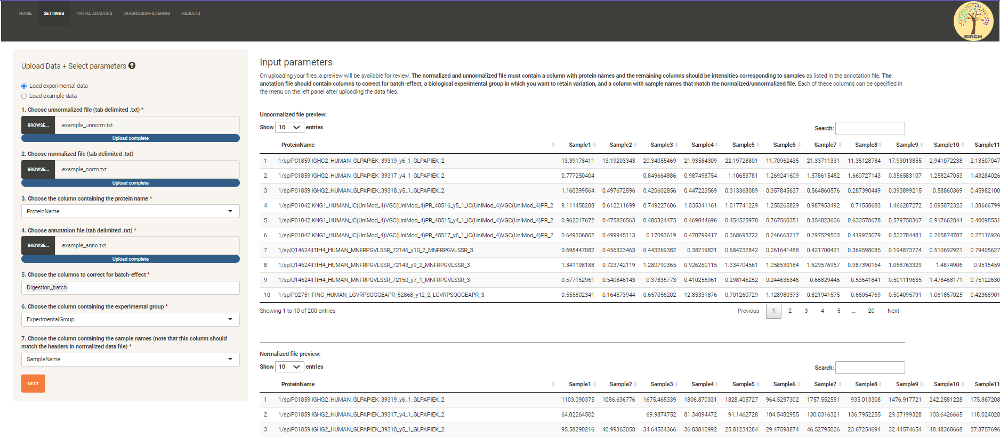
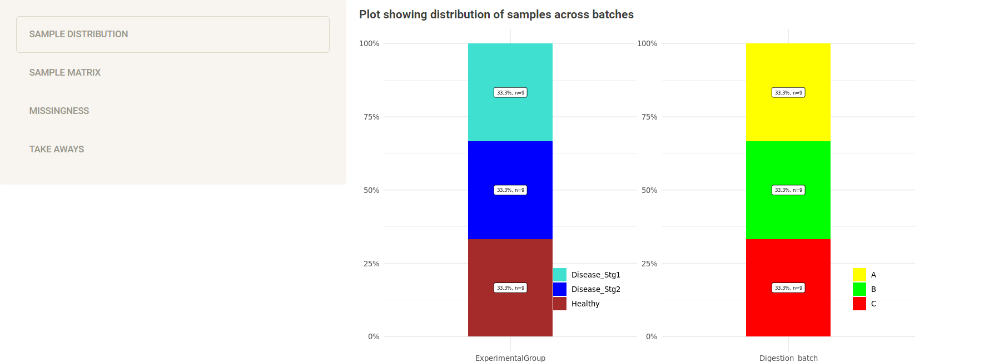
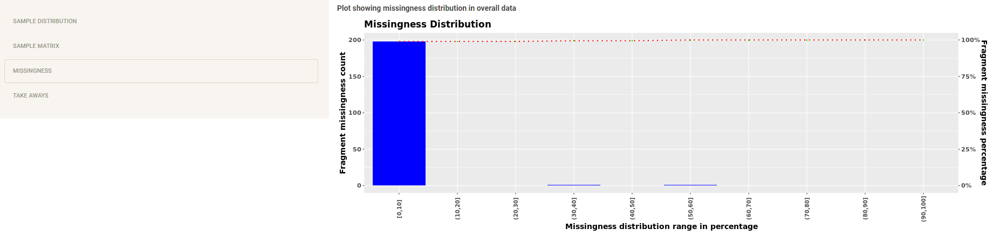
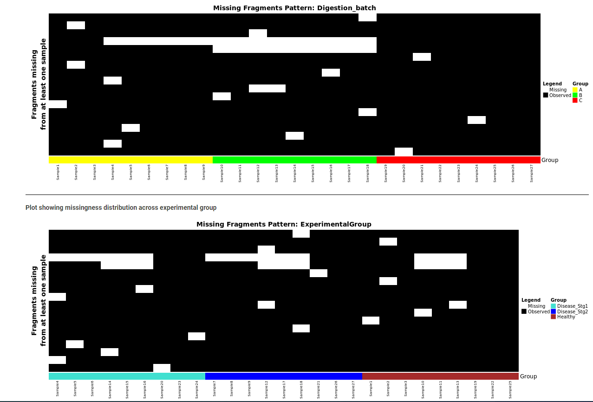
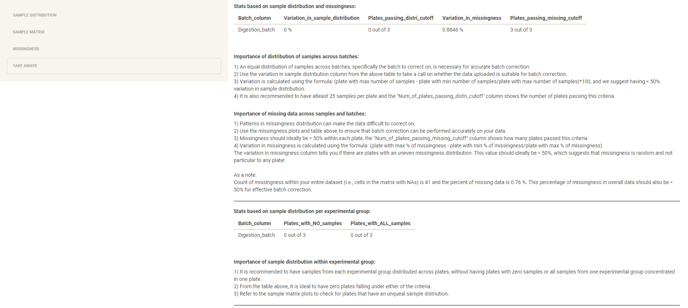
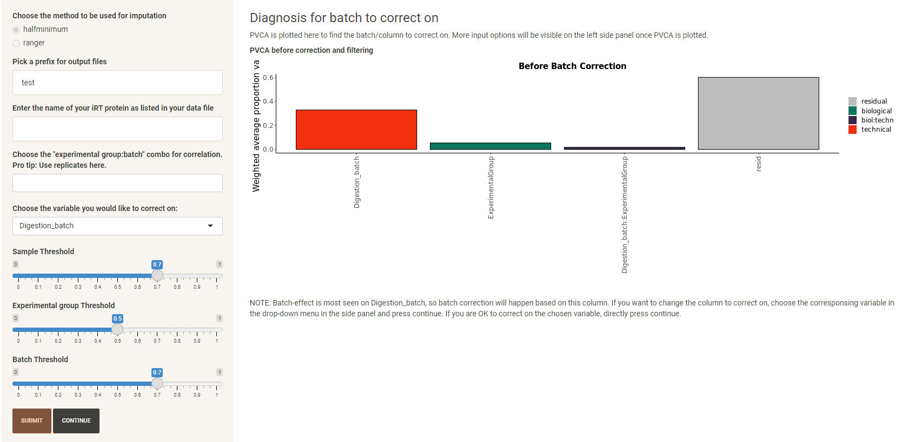

# Running BIRCH using example dataset

## Table of Contents
- [Home](#home)
- [Settings](#settings)
- [Initial Analysis](#initial-analysis)
- [Diagnosis+Filtering](#diagnosis+filtering)
- [Results](#results)

### Home
When the BIRCH web-app initially loads, the home tab is displayed at first. The home tab contains details on what BIRCH is and the workflow followed in BIRCH to go from data influenced by batch-effect to batch-corrected data. 

### Settings
From the home tab, you can navigate to the settings tab to set input parameters for batch correction. For this example, we will use a dummy dataset to demonstrate the entire process and make note of the things to look out for while dealing with your own data.  

To begin with analysis, you can either download [example_dataset.zip](https://github.com/csmc-vaneykjlab/BatchCorrectionTool/tree/main/example/example_dataset.zip) and give it as input to the respective parameters, or you can click on "Load example data" to pre-load all the input parameters. 

Using the example dataset, once the files are uploaded, the other parameters that need to be chosen (in bold for example dataset) are as follows:
- Argument 3 - **ProteinName** - this is the column that contains unique fragment/peptide/protein names.  
- Argument 5 - **Digestion_batch** - this is the column from the annotation file that represents the field/batch that needs to be analyzed for batch-effect and corrected. 
- Argument 6 - **ExperimentalGroup** - this column from the annotation file that represents the biological group in which we want to see and retain valid variation. 
- Argument 7 - **SampleName** - this argument maps the sample names (columns) in normalized/unnormalized intensities file, with the sample names in the annotation file where each row is a sample. 

Once all the options are chosen and files are uploaded, a preview of the files will be visible in the main screen. The settings tab looks as follows after all the input parameters are provided appropriately:

NOTE: Make sure to follow the instructions in the main GitHub page for instructions while using your own data. 

### Initial analysis
The initial analysis tab becomes active after clicking the "Next" button in the settings tab, once all the input options are verfied and accepted. This tab is a dynamic tab without user input and only contains statistics and plots created using the uploaded data. This tab further contains 4 sub-parts as follows:

1. **Sample distribution**: 
This section contains a stacked bar-plot displaying the distribution of samples among the chosen biological/experimental group and the column/s to correct on. In the exmaple data, the biological group is called "ExperimentalGroup" and the chosen column to correct on is "Digestion_batch", and these are the ones shown in the bar plot. Furthermore, in this particular sample set-up, it looks like there are exactly 9 samples (represnting 33.33% of all samples) per biological group (Disease_Stg1, Disease_Stg2 and Healthy) as well as digestion batch (groups A, B and C). 

This plot is useful to make sure samples are well distributed across the biological group and column to correct on. It is recommended to have an equal distribution of samples and to have atleast 25 samples per biological/technical group. 

2. **Sample matrix**:
The sample matrix section represents the distribution of samples as a matrix of intersections between experimental group and columns to correct on. If multiple columns were chosen to check for batch-effect, multiple balloon plots will be displayed. In this case, there are 3 samples in each of the cells/interections, i.e., digestion group A and biological group Disease_Stg1 has 3 samples as a part of those groups, and so on. 

This plot is useful to ensure not all samples from a particular biological group are in one technical group/pre-processing plate. Ideallly, there should be no intersection that is empty and no intersection with all samples concentrated in one spot.  

3. **Missingness**:
The missingness section focuses on the missing intensities in the normalized/unnormalized data table. The first plot seen in this section is a pareto plot which summarizes the missingness in the entire dataset. For our example data, this is how the pareto plot looks like

This plot shows the percentage of missingness in the x-axis, count of fragments missing that percentage of intensities on the left side of the y-axis, and also shows the fragments missingness percent on the right side of the y-axis. In our example, most fragments are only missing 0-10% of the data, while very few fragments are missing 30-40% and 50-69% of the data. 

Following the pareto plot, heatmaps showing the exact location of missing intensities is plotted per column to correct on and also based on the biological group. 

In these plots, it can be seen that two fragments have intencities missing for all samples in Digestion_batch group B (annotated in green). If there is a lot of missing data, the heatmap will have more white cells and lesser black cells. 

Ideally we want missingness to be less than 50% in overall data. 

4. **Take aways**:
This is the final section in inital analysis and it summarizes all the plots/statistics represented in the other sub-sections. A very detailed explaination on the imporatnce of sample distribution and missingness is provided in this section, along with recommendations on what the ideal situation would look like. For our example dataset, this is what the inital analysis looks like - 

It can be seen that except for the "Plates_passing_distri_cutoff" (which is to have atleast 25 samples per plate), all the other criteria are met in this dataset. 

### Diagnosis+Filtering
After validating whether the uploaded dataset is accurate for batch-correction with respect to randomization in sample distribution and missingness, it is time to determine the technical factor with the most amount of variation. Once the appropriate technical factor is chosen, batch-correction and imputation can be applied for further analysis. 

In this tab, initially, the user can choose the type of imputation to be used for the project. There are two types of imputation methods available, half-minimum and ranger (that uses a random forest model). For the purposes of this example, we can use half-minimum imputation which is faster. After choosing the imputation method and clicking on the submit button, a PVCA is calculated and plotted. The first bar in this plot represents the factor (technical or biological) that has the most amount of variation. Once the PVCA is plotted, the factor with the most variation is chosen as the batch to correct on. In this case example, digestion batch has the most amount of variation so that is chosen as the factor to correct on. Furthermore, additional input parameters appear in the left panel for user input. At this point, the app looks as follows - 

The additional input parameters (input for example in bold) are:
- Prefix for otuput files - **test** - Default value is test, which can be updated to anything you would like. These are files that will be available at in the Results (Download) section. 
- iRT protein name - **1/iRT_protein** - This optional parameter is used for plotting individual feature diagnostics like iRT peptides. 
- Experimental group:batch combo - Another optional parameter used for plotting correlation between QC samples across batches. This parameter can be provided only if the experimental design incldes QC samples. 
- Variable to correct on - **Digestion_batch** - Auto chosen by the algorithm depending on the factor with most variation. If biological group has most variation to begin with, a note suggesting batch-correction is not required will be generated. In the case of the example, Digestion_batch is chosen. 
- Filtering criteria - Set at defaults - Keep the same for example dataset. Refer to main GitHub page for details on what each of the filters mean. 

Once all the input parameters are provided, the continue button becomes available, which when clicked renders some plots that show how the filtering criteria will affect your data.

You can then hit the "Go to Results" button to view the final results. 

